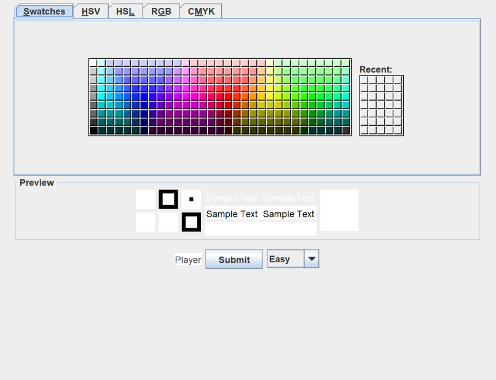
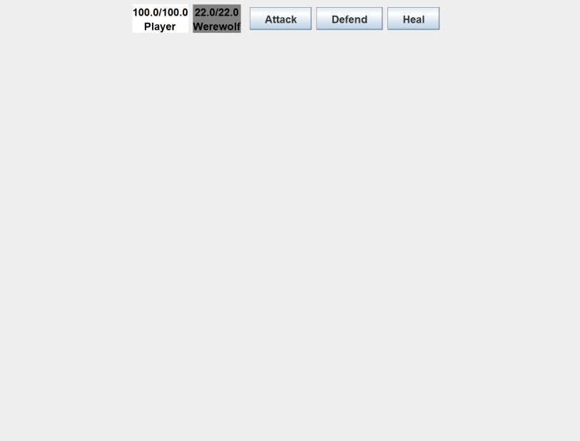
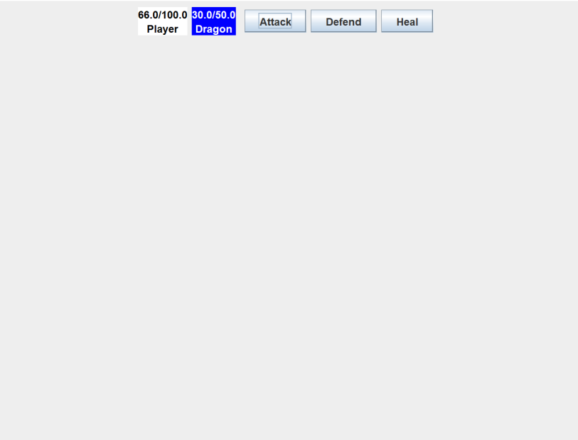

# CSC263 Final

<!-- TODO: Add information about SQLite3 -->

## Demo
### 7/8/24 (Beta-V1)

## Tasks
[X] Opening screen with a description of the application and instructions\
[X] Menu for the user to choose options\
[X] At least 4 classes in total\
[X] Inheritance (minimum 2 derived classes)\
[X] Polymorphism (Overloading and overriding)\
[X] Encapsulation\
[X] Abstraction\
[X] File input and output processing\
[ ] Multi-Threading\
[X] Iterators\
[X] Recursion \
[X] Exception handling\
[X] Generic programming