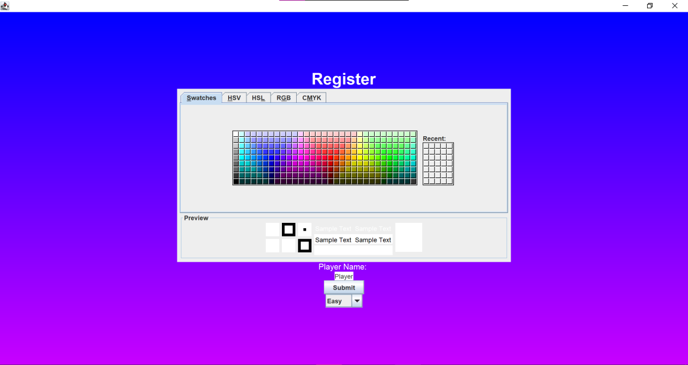
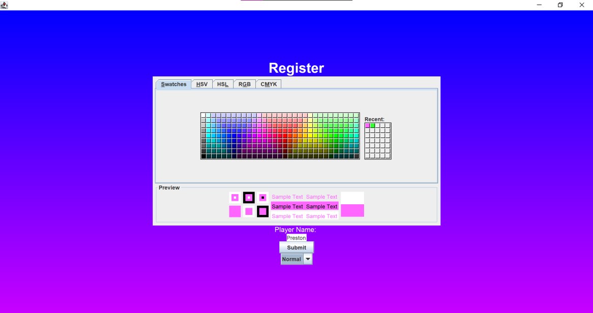
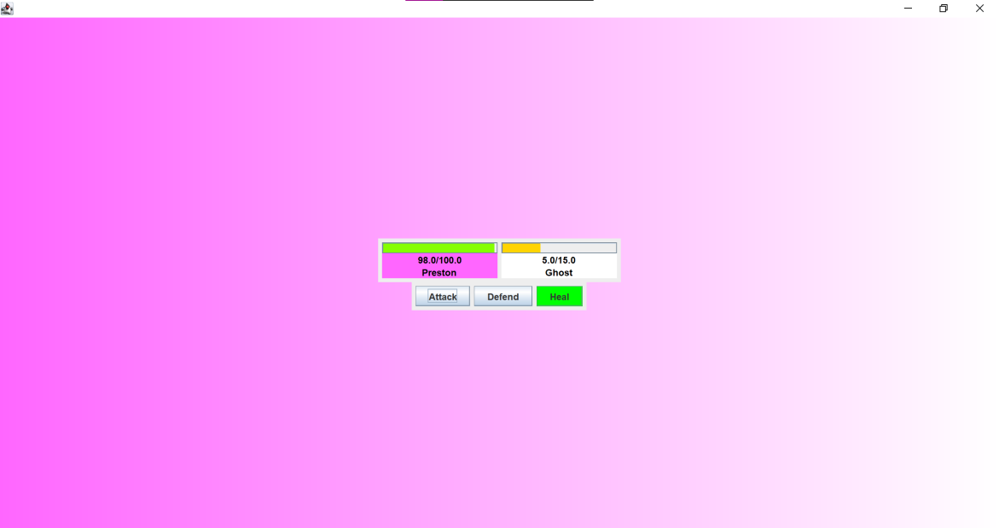
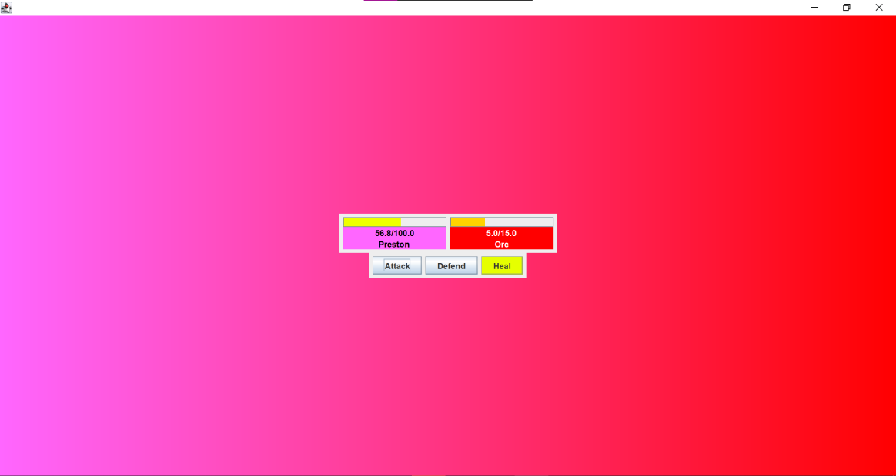
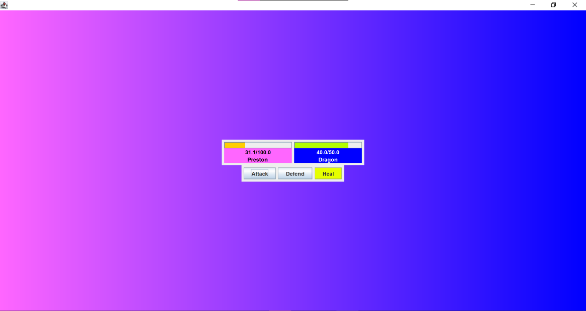
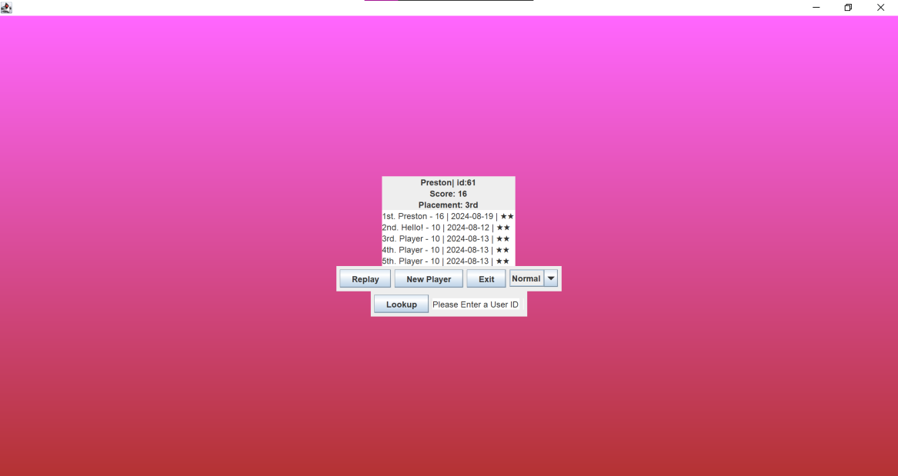
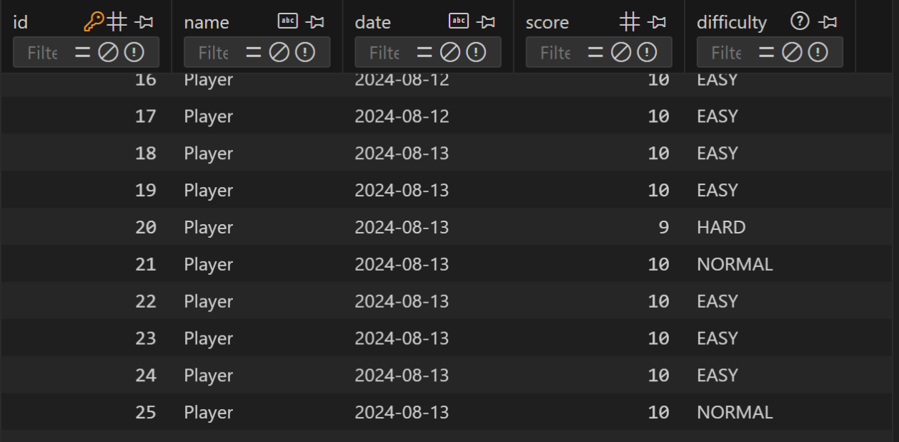

# CSC263 Final | RPG Simulator

## Description
This project is a standard Role Playing Game (RPG) simulator. The user will be able to choose their name, color, and difficulty, then they will fight a variety of enemies. The more waves you complete the higher your score will be. All scores are added to a local database, allowing you to see your ranking.

## SQLite 3
This project uses SQLite 3 to store the high-score data. The database is stored in the project folder. To connect to the local database the SQLite 3 driver `sqlite-jdbc-3.45.2.0` and the framework `slf4j-api-1.7.36`. Information on these can be found on the SQlite JDBC Driver [GitHub](https://github.com/xerial/sqlite-jdbc).

## Demo

### 8/19/24 (Release-V1)
#### Register

#### Game

#### Results

#### Database

### 7/8/24 (Beta-V1.1)

  
The source code can be found [here](https://github.com/pchapman-uat/CSC263-Final/releases/tag/Beta-V1.1)

## Tasks
- [X] Opening screen with a description of the application and instructions
- [X] Menu for the user to choose options
- [X] At least 4 classes in total
- [X] Inheritance (minimum 2 derived classes)
- [X] Polymorphism (Overloading and overriding)
- [X] Encapsulation
- [X] Abstraction
- [X] File input and output processing
- [ ] Multi-Threading
- [X] Iterators
- [X] Recursion 
- [X] Exception handling
- [X] Generic programming
